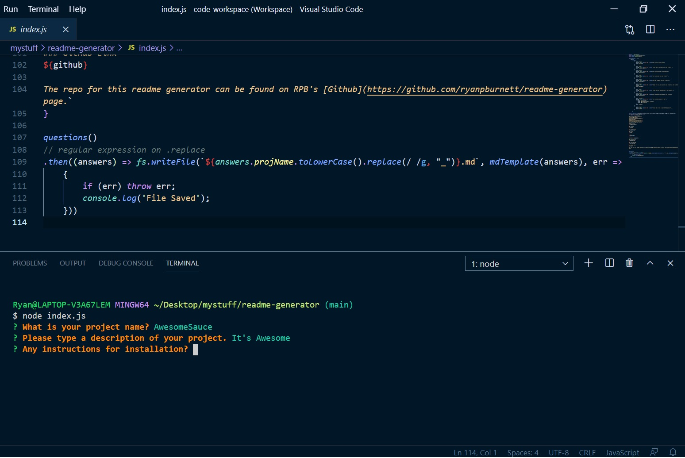

# Readme generator

[Description](#description)

[Licence](#license)

[Installation](#installation)

[Usage](#usage)

[Dependencies](#dependencies)

[Contributing](#contributing)

[GitHub Link](#github-link)


## Description
A quality readme generator that can be quickly executed

### License
GNU General Public Licence

### Installation
N/A

### Usage
Fill out prompts in a Node terminal, and a readme will be generated!

```
const fs = require("fs") \n const inquirer = require("inquirer") \n const chalk = require("chalk")
```



### Dependencies
inquirer and chalk, also see package.json

### Contributing
email me at ryanpburnett@yahoo.com

### GitHub Link
https://github.com/ryanpburnett

The repo for this readme generator can be found on RPB's [Github](https://github.com/ryanpburnett/readme-generator) page.